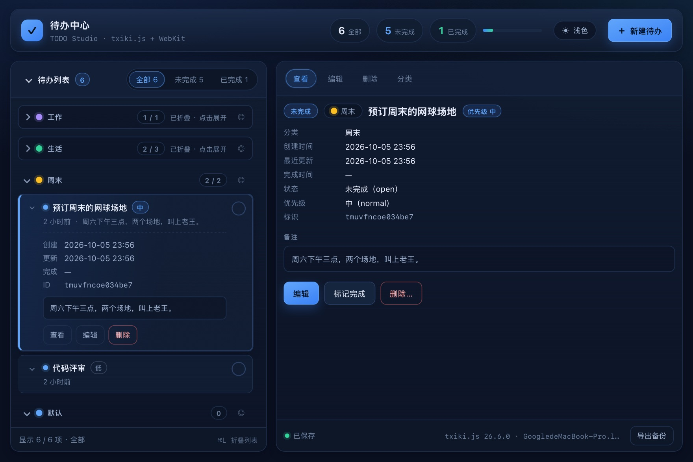
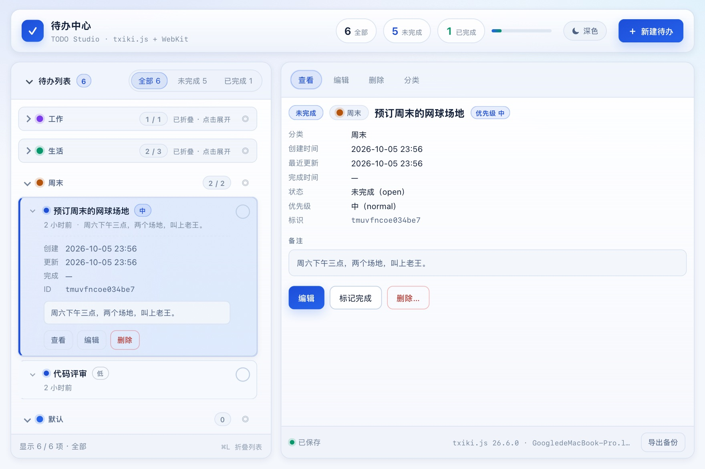

# 待办中心 · TODO Studio

一个用 [tinyjs](https://tinyjs.app) 写的桌面待办工具：**txiki.js 后端 + 系统原生 WebView（WKWebView）前端** ——
没有 Electron、没有 Chromium、没有内置 HTTP 服务，应用本体约 6 MB，前端零 npm 依赖。

`macOS 15+` · `tinyjs 0.47.1+` · `零运行时依赖` · [`MIT`](LICENSE)

```sh
tinyjs dev      # 开发（前端改动热替换，后端改动自动重启）
tinyjs build    # 打包 dist/todo（本机运行）与 dist/待办中心 · TODO Studio.app（可分发）
```

## 界面预览

| 深色主题 | 浅色主题 |
| --- | --- |
|  |  |

截图来自本项目自检页的真实运行结果（保存在 `docs/screenshots/`，重新生成方式见「[测试](#测试)」）。

布局是**左右分栏**：左栏是按分类分组的待办列表（分类可逐个折叠、可"只看某分类"），
右栏是**查看 / 新建 / 编辑 / 删除 / 分类**五个面板；顶栏只有一颗外观按钮和一个「＋ 新建待办」按钮，
底部状态栏显示保存状态、运行时信息与「导出备份」。窗口窄于 900px 时自动降级为上下堆叠。

## 目录

- [功能特性](#功能特性)
- [技术栈](#技术栈)
- [运行环境要求](#运行环境要求)
- [安装与启动](#安装与启动)
- [构建与分发](#构建与分发)
- [使用说明与关键交互](#使用说明与关键交互)
- [配置项](#配置项)
- [入口与职责划分（去重方案）](#入口与职责划分去重方案)
- [数据与存储（字段与取舍）](#数据与存储字段与取舍)
- [目录结构](#目录结构)
- [测试](#测试)
- [许可证](#许可证)
- [贡献指南](#贡献指南)
- [联系方式](#联系方式)

## 功能特性

- **左右分栏**：左侧待办列表，右侧操作面板；窄屏（<900px）自动降级为上下堆叠
- **分类**：自带「工作 / 生活 / 周末 / 默认」四个种子分类，可**新增 / 重命名 / 换色 / 删除**
  （删除时其条目自动转入「默认」，并有二次确认与条数提示）；左侧**按分类分组**，
  分组可逐个折叠，也可「◎ 只看某分类」（顶部出现可关闭的聚焦胶囊）；
  新建 / 编辑**必须选择分类**（默认预选，记住上次选择），未选时给出校验提示
- **外观**：顶栏只有**一颗**外观按钮（浅色 ↔ 深色来回切，不做三档并列）。默认**跟随系统**，
  未手动选择前始终按系统设置自动适配；点一下即切到"当前所见"的反面并**退出跟随**（提示会说明），
  图标随点击**立即翻转**（深色时显示浅色图标、浅色时显示深色图标，图标即"点下去会得到什么"）。
  手动选择会持久化，刷新与重开应用都保持；跟随系统时按钮上挂一枚「自动」小牌，
  想回到自动模式用菜单栏「外观：跟随系统」（唯一入口）。
  跟随系统期间通过 `tiny.theme.on` + `prefers-color-scheme` 双通道**实时响应系统主题变化，无需刷新**
- **列表**：分类分组头（色点 + 名称 + 未完成/总数）+ 标题 + 状态 + 优先级 + 相对时间 + 备注摘要；
  整体 / 分类分组 / 单条三级折叠，折叠有 chevron 旋转、斜纹提示条、计数徽标三重反馈
- **五种面板模式**：查看 / 新建 / 编辑 / 删除 / 分类（删除需二次确认），切换时**未保存的草稿会保留**
  并以横幅 + 角标提示，可随时"继续编辑"或"放弃草稿"
- **数据持久化**：写入 tinyjs 的 per-app `tiny.store`（`~/Library/Application Support/com.example.todo/store.json`），
  刷新页面、重开应用都不丢；主题、折叠状态、聚焦分类与筛选条件同样会被记住
- **校验**：标题必填（纯空格也会被拦）、标题 ≤120 字、备注 ≤500 字、分类必须有效，失败有字段级错误 + 抖动 + 轻提示
- **原生集成**：菜单栏「待办」（⌘N 新建 / ⌘E 编辑 / ⌘D 删除 / ⌘L 折叠列表 / ⌘K 分类管理 /
  ⌘T 切换外观 + 「外观：跟随系统」/ ⌥⌘E 导出备份）、窗口标题实时显示未完成数、导出备份会在访达中定位文件

## 技术栈

| 层 | 用到的东西 | 说明 |
| --- | --- | --- |
| 窗口 | 系统自带 WebView（macOS 为 WKWebView，Windows 为 WebView2，Linux 为 WebKitGTK 4.1） | 不打包浏览器内核，随系统更新；应用因此只有几 MB |
| 后端 | [txiki.js](https://github.com/saghul/txiki.js)（QuickJS + libuv，ES2020） | 只提供两个能力：`info()` 读运行时/主机信息、`exportBackup()` 把备份写进真实文件系统 |
| 前后端桥 | `tiny.*`（私有目录 Unix socket 上的 RPC，不走 HTTP、不开端口） | 全部收敛在 `src/frontend/js/app-ns.js`；`tiny` 不存在时自动降级为内存实现，浏览器里也能开 |
| 前端 | 原生 HTML / CSS / JavaScript，无框架、无打包器、无 TypeScript | WKWebView 下 `file://` 不支持跨文件 ES module，故与官方脚手架一致：经典 `<script>` + 命名空间（`model → store → ui → app`） |
| 样式 | CSS 自定义属性（设计令牌）+ 深/浅两套主题板 + 8 个分类色槽 | 组件规则只引用令牌，不写死颜色，换肤只改令牌层 |
| 打包 | `tinyjs build`（codesign、`.app`、`--dmg`、`--universal`） | 产物：`dist/todo`（裸可执行）+ `dist/待办中心 · TODO Studio.app` |
| 测试 | Node 原生脚本（模型层单测）+ 真实 WebKit 端到端自检 | 测试驱动刻意放在 `tools/`，不进发布包 |

## 运行环境要求

| 项目 | 要求 | 备注 |
| --- | --- | --- |
| 操作系统 | **macOS 15 或更高**（tinyjs 当前版本的地板）；Apple Silicon 与 Intel 均可 | Windows 10/11（需 WebView2）与 Linux（glibc 2.35+，需 `libwebkit2gtk-4.1-0`）是 tinyjs 的 beta 平台 |
| tinyjs CLI | **0.47.1 或更高** | 由 `tinyjs.json` 的 `minTinyjsVersion` 强制校验，过低会给出明确报错 |
| Node.js | **不需要**（只为跑本仓库的测试 / 同步脚本而需要，≥ 18 即可） | tinyjs CLI 与运行时都跑在 txiki.js 上，不依赖 Node 或 npm |
| 依赖安装 | **无**：没有 `package.json`，没有 `node_modules` | `git clone` 完即可 `tinyjs dev` |

## 安装与启动

```sh
# 1) 安装 tinyjs CLI（macOS / Linux 同一脚本；Windows 用 install.ps1）
curl -fsSL https://tinyjs.app/install | sh
# Windows PowerShell：irm https://tinyjs.app/install.ps1 | iex

# 2) 取源码
git clone https://github.com/ryanhel/todo-studio && cd todo-studio

# 3) 开发运行：前端改动热替换，后端改动自动重启
tinyjs dev
```

- 首次启动会自动写入四个种子分类（工作 / 生活 / 周末 / 默认），数据落在
  「[配置项 → 数据存储](#数据存储)」所说的位置；删掉存储文件即可回到这个初始状态。
- **只想调样式**：直接用浏览器打开 `src/frontend/index.html` 即可 —— `tiny` 缺失时前端自动降级
  （内存存储、跟随系统主题、无原生菜单），除落盘与菜单外都能改；页面内快捷键同样可用。
- 想给单个文件开一个独立运行环境（例如跑自检页，不污染正式数据）：
  `TINYJS_HTML="$(pwd)/tools/build/selftest.html" tinyjs dev`（见「[测试](#测试)」）。

## 构建与分发

```sh
tinyjs build                  # dist/todo + dist/待办中心 · TODO Studio.app（已 codesign）
tinyjs build --arch arm64     # 额外产出 M 系列原生的 .app（在 Intel 机器上构建时用）
tinyjs build --universal      # 一个 .app 同时含 x86_64 + arm64（需 Command Line Tools 的 lipo）
tinyjs build --dmg            # 额外产出 .dmg 安装镜像
tinyjs publish --notes "…"    # 打包 dist/publish/<name>-<ver>.zip + manifest（自动更新用）
tinyjs notarize --dmg         # 提交 Apple 公证并 staple（正式分发必做）
```

几个容易踩的点：

- **默认产物只含宿主 CPU**：这里构建出的 `.app` 是 Intel（x86_64），Apple Silicon 上要靠 Rosetta 2 运行；
  想让一个包通吃用 `--universal`，或分别出 `--arch arm64` / `--arch x86_64`。
- **分发前先改 `tinyjs.json` 的 `id`**：当前是占位值 `com.example.todo`，它决定数据目录
  （`~/Library/Application Support/<id>/`）与单实例标识；改 id 之后旧数据不会自动迁移。
- **签名与公证**：未配置 Developer ID 时 tinyjs 走 ad-hoc 签名 —— 本地能用，分发会被 Gatekeeper 拦；
  正式分发请配 `signIdentity`（或环境变量 `TINYJS_SIGN_IDENTITY`）并跑 `tinyjs notarize`。
  注意 dmg 要由 `notarize --dmg` 生成：构建时打的 dmg 装的是"贴票前"的包，离线机器会拒开。
- **不能跨系统打包**：Windows / Linux 的包必须在对应系统上构建（tinyjs 只打包宿主平台的启动器）。

## 使用说明与关键交互

### 鼠标

| 操作 | 怎么做 | 结果 |
| --- | --- | --- |
| 查看 | 点条目任意处 | 右栏切到「查看」面板，显示状态 / 分类 / 优先级 / 时间 / 标识 / 备注 |
| 完成 / 取消完成 | 点条目右侧的圆圈 | 即勾选，标题加删除线；计数与窗口标题同步更新 |
| 展开一条 | 点条目左侧的 `⌄` | 就地展开创建 / 更新 / 完成时间、ID、备注与操作按钮（三级折叠的最内层） |
| 折叠分类分组 | 点分组头（色点 + 名称 + 计数） | 每个分类各自记折叠状态，与整表折叠互不干扰 |
| 只看某个分类 | 点分组头右侧的 `◎` | 顶部出现可关闭的聚焦胶囊，列表只剩该分类 |
| 折叠整个列表 | 点左栏头部「▾ 待办列表」 | 折叠后只留一列标题，右栏面板不受影响 |
| 筛选 | 顶栏「全部 / 未完成 / 已完成」 | 计数随数据实时更新，筛选条件会被记住 |
| 新建待办 | 顶栏「＋ 新建待办」 | 右栏切到新建表单，**必须选择分类**（默认预选、记住上次选择） |
| 编辑 / 删除 | 查看面板的按钮，或面板页签 | 删除是二次确认；删除分类会提示受影响条数并把条目转入「默认」 |
| 管理分类 | 面板页签「分类」 | 新增 / 重命名 / 换色（8 个色槽：科技蓝·紫·绿·琥珀·粉·青·橙·灰）/ 删除 |
| 切换外观 | 顶栏那颗 `☀ / ☾` | 图标是"点下去会得到什么"，一次点击即切换并**退出跟随系统** |
| 导出备份 | 底部状态栏「导出备份」，或 `⌥⌘E` | 写一份 JSON 到应用数据目录，并在访达中定位该文件 |

### 键盘与菜单

| 快捷键 | 动作 |
| --- | --- |
| `⌘N` | 新建待办 |
| `⌘E` | 编辑选中项 |
| `⌘D` | 删除选中项（二次确认） |
| `⌘L` | 折叠 / 展开待办列表 |
| `⌘K` | 打开分类面板 |
| `⌘T` | 切换外观（浅色 ↔ 深色） |
| `⌥⌘E` | 导出 JSON 备份 |
| `⌘Enter` | 表单里保存 |
| `Enter` / `Space` | 列表条目获得焦点时选中；删除确认面板里确认 |
| `Esc` | 从任何临时模式退回「查看」（表单里等价于取消） |

菜单栏「待办」里有以上全部动作，另外 `外观：跟随系统` 是**回到自动模式的唯一入口**（勾选态表示当前正在跟随）。
页面内快捷键在没有原生菜单（浏览器预览）时同样可用。

### 反馈与容错

- 底部状态栏：保存状态（`保存中… / 已保存 / 保存失败`）+ 运行时信息（txiki.js 版本 · 主机名 · CPU · PID）+「导出备份」。
- 窗口标题实时带未完成数，例如 `待办中心 · 3 项未完成`。
- 校验失败：字段级错误 + 抖动 + 轻提示（标题必填且 ≤120 字、备注 ≤500 字、分类必须有效）。
- 切换面板模式时**未保存的草稿会保留**：横幅 + 角标提示，可「继续编辑」或「放弃草稿」。
- 空列表与"未选中条目"只给引导文案，不放按钮 —— 避免和顶栏「＋ 新建待办」变成两个入口。

## 配置项

### 应用清单：`tinyjs.json`

```json
{
  "name": "todo",
  "title": "待办中心 · TODO Studio",
  "size": "1080x720",
  "id": "com.example.todo",
  "version": "0.2.2",
  "minTinyjsVersion": "0.47.1"
}
```

| 字段 | 当前值 | 说明 |
| --- | --- | --- |
| `name` | `todo` | 裸可执行文件名、发布包名；改名前请确认脚本 / 文档同步 |
| `title` | `待办中心 · TODO Studio` | 窗口标题、`.app` 名、Dock 名 |
| `size` | `1080x720` | 初始窗口尺寸（窄于 900px 时前端自动改为上下堆叠布局） |
| `id` | `com.example.todo` | **分发前请改成你自己的反向域名**：决定数据目录与单实例标识 |
| `version` | `0.2.2` | 版本号，构建 / 发布 / CHANGELOG 对齐 |
| `minTinyjsVersion` | `0.47.1` | 低于该版本的 CLI 拒绝运行并给出明确提示，而不是报一堆难懂的错 |

### 外观模式（主题）

- 状态存在 `todo.ui.v1.themeMode`，三态：`system`（默认）/ `light` / `dark`。
  手动选过之后会持久化，重开应用与刷新页面都保持；回到 `system` 只能走菜单栏「外观：跟随系统」。
- 生效结果写在 `<html>` 上，方便样式与调试：
  `data-theme="light|dark"`（当前实际生效的）+ `data-theme-mode="system|light|dark"`（用户选了什么）。
- **跟随系统**期间有两条独立通道实时响应，不需要刷新：`tiny.theme.on`（launcher 推送系统主题）
  与 `prefers-color-scheme`（页面侧兜底，保证首帧就对）；手动选过之后系统推送会被忽略（自检里已断言这一点）。
- 样式全在 `src/frontend/style.css`，分三层：**结构令牌 → 深色板 / 浅色板 → 组件规则（只引用令牌）**。
  浅色令牌有两份：显式选择用的 `:root[data-theme="light"]`，与"跟随系统且首帧还来不及打标"时的
  `@media (prefers-color-scheme: light)` 兜底。改配色只改显式那份，然后跑
  `node tools/sync-light-theme.js` 把兜底那份同步过去（幂等，手写两份迟早漂移）。
- 分类颜色存的是**槽位**（`c1`…`c8`）而不是色值，真实颜色由主题层给出 —— 所以换主题时分类色自动跟随，
  深浅两套都过了对比度检查。

### 数据存储

- 位置：`~/Library/Application Support/<id>/store.json`（`<id>` 即 `tinyjs.json` 里的 id，当前是 `com.example.todo`），
  单文件 JSON，由 tinyjs 的 per-app `tiny.store` 管理；字段与设计取舍见下一节。
- **重置**：退出应用后删掉 `store.json` → 下次启动回到种子分类 + 空列表；
  只想重置界面状态（选中项、折叠、筛选、主题），就只删 `todo.ui.v1` 这个键。
- **导出备份**：`⌥⌘E` 或状态栏「导出备份」→ 同目录下 `todo-backup-<时间戳>.json`（内容由页面组装，后端只负责落盘）。
- **容错**：读取时一律归一化（`sanitize()` / `sanitizeCategories()` / `assignCategories()`）——
  手改坏存储文件不会把应用带崩，分类被删后遗留的 `categoryId` 会在下次启动自动收敛到「默认」。

### 环境变量

| 变量 | 作用 |
| --- | --- |
| `TINYJS_HTML` | 指定要加载的自包含页面（跑自检用 `tools/build/selftest.html`）—— 发布包里没有测试页，靠它注入 |
| `TINYJS_DEBUG=1` | 打印每一条桥接消息，排查前后端通信 |
| `TINYJS_SIGN_IDENTITY` | 构建时的签名身份，覆盖 `tinyjs.json` 的 `signIdentity` |
| `TINYJS_NOTARY_PROFILE` | 公证用的钥匙串凭据 profile（先用 `xcrun notarytool store-credentials` 建立） |

## 入口与职责划分（去重方案）

上一版同一动作出现了多个并列入口，这一版按"动作的作用域"重新划了边界：

| 动作 | 唯一入口 | 保留的等价通道 | 为什么这么定 |
| --- | --- | --- | --- |
| 新建待办 | 顶栏 **「＋ 新建待办」** | ⌘N、菜单栏「新建待办」（同一动作的不同触发方式，不是并列按钮） | 新建是**全局动作**，与"当前选中了什么"无关，属于顶栏 |
| 折叠待办列表 | 左栏头部 **「▾ 待办列表」** | ⌘L、菜单栏「折叠 / 展开列表」 | 控件紧贴它控制的内容（局部性原则）；顶栏那颗重复的「列表」按钮已删除 |
| 编辑 / 删除 | 查看面板的 **编辑 / 删除** 按钮 | 面板页签、⌘E / ⌘D、菜单栏 | 这两个动作**依赖选中项**，属于"详情面板"的作用域 |
| 新建表单的位置反馈 | 面板模式条里的 **「新建」状态牌**（`<span>`，不可点击） | — | 需要让用户知道"面板现在在新建态"，但不能再造第二个入口 |
| 管理分类 | 面板页签 **「分类」** | ⌘K、菜单栏「分类管理…」 | 分类是独立资源，不属于单条待办，所以单开一个面板页，而不是塞进待办表单 |
| 切换外观 | 顶栏 **单按钮**（`☀ / ☾`，浅色 ↔ 深色） | ⌘T、菜单栏「切换外观」 | 外观只有"换一下"这一个动作；三档并列（浅色/深色/系统）本身就是三个并列入口，已合并为一颗按钮。**回到自动模式**走菜单栏「外观：跟随系统」（非视觉入口，勾选态表示当前在自动） |

配套的界面改动：

- 空态（列表无数据）与占位态（未选中条目）**只保留引导文案**，不再放「新建」按钮 ——
  它们与顶栏按钮同屏并列，是最容易造成"两个按钮干同一件事"的地方。
- 折叠相关的状态只有一份真相（`state.ui.listCollapsed`），
  键盘 / 菜单 / 左栏控件都改同一个字段，所以永远不会出现"一个折叠了另一个没跟上"。
- 分类维度的折叠（`collapsedCategories[categoryId]`）与整表折叠**是两个独立维度**，
  各有各的状态与控件，互不干扰。

## 数据与存储（字段与取舍）

三个存储键各管一摊：

| 键 | 内容 | 写入时机 |
| --- | --- | --- |
| `todo.items.v1` | 待办数组，每条含 `id / title / note / priority / categoryId / status / createdAt / updatedAt / doneAt` | 增删改、状态切换、删除分类转移条目 |
| `todo.categories.v1` | 分类数组，每项含 `id / name / color / builtin / createdAt` | 分类新增 / 改名 / 换色 / 删除 |
| `todo.ui.v1` | `themeMode / listCollapsed / collapsedCategories / focusCategoryId / expanded / filter / selectedId / lastCategoryId` | 折叠、筛选、选中、外观切换等界面状态 |

两个设计取舍：

- **分类颜色存"槽位"（`c1`…`c8`）而不是色值**：真实颜色由主题层决定
  （深色板偏亮、浅色板偏深，各自都过了对比度检查），所以换主题时分类色自动跟随，
  不会出现"浅色主题下某个分类看不清"。
- **读取时一律归一化**：`model.sanitize()` / `sanitizeCategories()` / `assignCategories()`
  负责丢脏数据、修重复 id、把失效或缺失的分类归到「默认」。手改坏了存储文件也不会把应用带崩，
  分类被删掉后遗留的 `categoryId` 也会在下次启动自动收敛。

## 目录结构

```
tinyjs.json                 应用清单（名称 / 尺寸 / id / 版本 / minTinyjsVersion）
icon.png                    应用图标源图（tinyjs build 打成 .app 的 AppIcon）
jsconfig.json               编辑器的 JS 提示配置（不影响运行）
src/main.js                 后端：info() 环境信息、exportBackup() 写 JSON 备份
src/frontend/
  index.html                页面骨架：只挂一个 #app 与脚本链
  style.css                 全部样式：设计令牌（结构 + 深色板 + 浅色板 + 分类色槽）在顶部，
                            组件规则只用令牌；浅色令牌两份（显式选择 + 系统跟随首帧兜底）
  js/
    app-ns.js               命名空间 + tiny.* 桥接（主题读取/订阅、菜单更新、文件对话框…，
                            tiny 缺失时自动降级，可在浏览器里调样式）
    model.js                纯逻辑：校验 / 增删改 / 状态流转 / 排序分组 / 统计 / 归一化 /
                            时间格式 + 分类模型（校验 / 归一化 / 归组 / 兜底）
    store.js                持久化：tiny.store 驱动 + 内存驱动 + 保存状态回调（items / categories / ui 三键）
    ui.js                   视图：骨架、顶栏（外观切换）、分类分组列表、面板五模式、提示；只画 DOM，不碰数据
    app.js                  控制器：唯一状态真相、动作、事件委托、快捷键、主题解析、原生菜单、启动
tools/
  model.test.js             模型层单元测试（Node，零依赖）
  selftest.js               端到端自检驱动（只在自检页里跑，不进发布包）
  build-selftest.js         把前端 + 驱动内联成自包含的 tools/build/selftest.html
  sync-light-theme.js       把浅色令牌从显式选择块同步到"跟随系统"兜底块（幂等）
types/
  tiny.d.ts / tjs.d.ts      框架 API 类型提示（编辑器补全用，不参与构建）
docs/screenshots/           README 用的深浅两套界面截图
README.md / CHANGELOG.md    本文档 / 版本变更记录
LICENSE                     MIT 许可证
.gitignore                  忽略规则：dist / .build / tools/build、依赖、日志、密钥、本地环境
```

> `src/frontend/` 会被 `tinyjs build` 整个复制进 `dist`，所以测试页面与驱动
> 刻意放在 `tools/`（产物在 `tools/build/`），发布包里只有应用本身。

> `.claude/` 与 `.agents/` 是 tinyjs 脚手架附带的 agent skill 文档（两份内容完全重复、会随框架版本变旧），
> 默认不跟踪 —— 想让协作者的编码代理直接读到框架 API，把 `.gitignore` 里那两行删掉即可（内容不含密钥）。

> 改浅色配色只需改 `style.css` 里的 `:root[data-theme="light"]` 一段，
> 然后 `node tools/sync-light-theme.js` 把另一份同步过去（手写两份迟早会漂移）。

## 测试

**1) 模型层单测（无需 GUI）**

```sh
node tools/model.test.js        # 28 项：校验 / 状态流转 / 排序统计 / 分类模型 / 脏数据归一化 / 时间格式
```

**2) 端到端自检（真实 WebKit + 真实落盘 store）**

```sh
node tools/build-selftest.js
TINYJS_HTML="$(pwd)/tools/build/selftest.html" tinyjs dev
```

自检驱动真实 UI 完成 **132 项断言**（phase1 118 + phase2 14），覆盖：入口唯一性约束、
空态引导、新建（含分类选择与校验拦截）、草稿保留与恢复、分类 CRUD（新增 / 重名拦截 / 改名 /
换色 / 删除转移）、分类分组折叠、只看某分类、三级折叠、编辑、删除二次确认、Esc 取消、
**外观单按钮切换（图标语义 / 退出跟随 / 两档来回切 / 自动态小牌）+ 系统主题实时响应
（用 launcher 的真实推送通道 `__emit` 模拟）**，以及
**页面重载后的持久化**（条数 / 标题 / 分类集合 / 分类归属 / 折叠 / 主题逐一比对）。

自检结束时会导出深浅两套 UI 快照（README 顶部那两张图就是这么来的）：

```sh
# PDF → PNG → JPEG，落到 docs/screenshots/
qlmanage -t -s 1760 -o /tmp /tmp/todo-ui-dark.pdf
qlmanage -t -s 1760 -o /tmp /tmp/todo-ui-light.pdf
sips -s format jpeg -s formatOptions 80 /tmp/todo-ui-dark.pdf.png  --out docs/screenshots/dark.jpg
sips -s format jpeg -s formatOptions 80 /tmp/todo-ui-light.pdf.png --out docs/screenshots/light.jpg
```

> 注意：`TINYJS_HTML` 的页面会被 tinyjs 物化到临时目录，因此**必须自包含**——
> 这就是 `build-selftest.js` 存在的原因（它内联的正是 index.html 加载的同一批源码，
> 生成物 `tools/build/selftest.html` 不要手工编辑）。

## 许可证

本项目以 **MIT License** 开源，版权归 © 2026 Ryanhel —— 完整文本见 [`LICENSE`](LICENSE)。
你可以自由使用、复制、修改、合并、发布、分发、再许可与销售，只需保留版权声明与许可声明；
软件按"现状"提供，不含任何形式的担保。

- **框架**：tinyjs 运行时与 CLI 同样是 MIT（© tarwin，仓库 <https://github.com/tarwin/tinyjsapp>），
  但不随本仓库分发 —— 它们由 `curl -fsSL https://tinyjs.app/install | sh` 装到本机。
- **随仓库保留的框架文件**：`types/tiny.d.ts`、`types/tjs.d.ts`（API 类型提示，编辑器补全用）。
- **不跟踪的**：框架自带的 agent skill 文档（`.claude/`、`.agents/`）与构建产物（`dist/`、`.build/`、`tools/build/`）。
- 想换成别的许可证（Apache-2.0 / GPL / 闭源商业…）改 `LICENSE` 与本段说明即可，
  README 顶部那行徽标也一并改掉。

## 贡献指南

欢迎 issue 与 PR。为了让改动好合并，麻烦先对齐这几条：

1. **改前跑一次测试，改后再跑一次**：

   ```sh
   node tools/model.test.js                                                                     # 模型层单测，28 项
   node tools/build-selftest.js && TINYJS_HTML="$(pwd)/tools/build/selftest.html" tinyjs dev     # 端到端自检，132 项断言
   ```

   两个都绿再提交；用户可见的行为变化请顺带更新 `CHANGELOG.md`（版本号在 `tinyjs.json` 里同步）。
2. **提交信息**：语义化前缀 + 中文正文，重点说清"为什么"。
   `feat:` 新功能 / `fix:` 修缺陷 / `style:` 纯样式 / `test:` 测试 / `docs:` 文档 / `chore:` 杂项。
   例：`fix: 折叠列表后筛选计数不再重置选中项`。
3. **代码约定**（都是之前踩过的坑，尽量别退回去）：
   - 零运行时依赖、无打包步骤：前端就是 `index.html` 里那几个 `<script>`；
   - 状态只有一份真相（`app.js` 的 `state`），视图只画 DOM 不碰数据，业务规则只写在 `model.js` 的纯函数里；
   - 样式只引用设计令牌、不写死颜色；动浅色令牌记得跑 `node tools/sync-light-theme.js`；
   - 新增动作先回答"它的作用域是什么、唯一入口放哪"（见「入口与职责划分（去重方案）」），
     不要在主区、面板、空态里再放第二个等价按钮；
   - 任何插进 `innerHTML` 的文本都要转义（`ui.js` 里已有 `esc()`）—— 页面是本地页，但数据可以是任意文本。
4. **别提交** `dist/`、`.build/`、`tools/build/` 与任何本地数据 / 密钥（`.gitignore` 已经挡住，
   提交前用 `git status` 再过一眼）。

## 联系方式

- **仓库**：<https://github.com/ryanhel/todo-studio>
- **Bug 与功能建议**：<https://github.com/ryanhel/todo-studio/issues>
- **框架本身的问题**（tinyjs / txiki.js）：<https://github.com/tarwin/tinyjsapp> · <https://tinyjs.app>
- **作者**：Ryanhel（GitHub [@ryanhel](https://github.com/ryanhel)）
